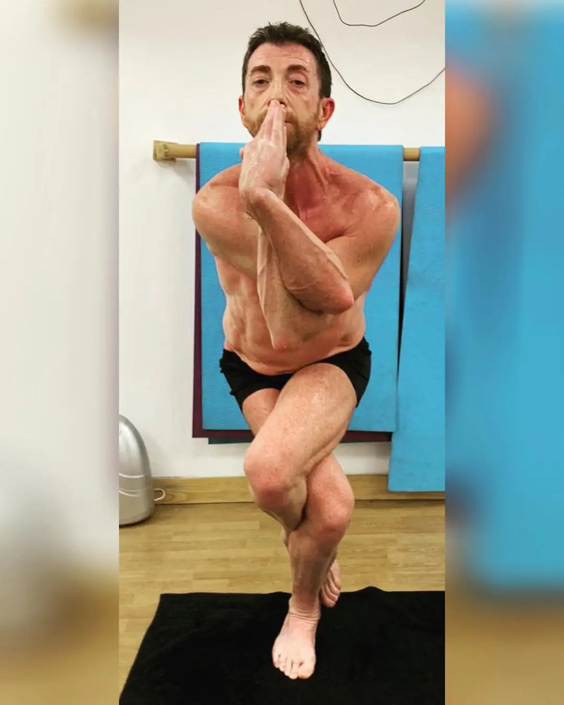

# Eventos Deportivos Corre y Vuela
Proyecto final de fp donde vamos a crear una empresa encargada de crear carreras de senderismo, trail y ciclismo

## Subtitulo


### Cabecera


Esto es **negrita**

Esto es *cursiva*

- Elemento1
- Elemento2
    - Elemento3
        - Elemento4
- Elemento5


`pip install Flask`

`mkdir templates Flask`

```
if (codigo){}
```


| Cabercera1 | Cabecera2 | Cabecera3 |
|---|---|---|
| Cabercera1 | Cabecera2 | Cabecera3 |


